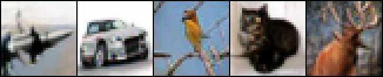

# Un-0

<p align="center">
  
</p>

Un-0 is an image-generation model built on
[Kuramoto dynamics](https://en.wikipedia.org/wiki/Kuramoto_model): it generates
an image by integrating the phase dynamics of a population of coupled
oscillators — no diffusion schedule, no adversary, no iterative denoising.

It comes from [Unconventional AI](https://unconv.ai), where we research
dynamical systems as a computing substrate: they map onto analog and physical
hardware that points toward orders-of-magnitude (on the order of 1000×) lower
energy for AI than today's digital accelerators.

This repository is a plain-PyTorch reference implementation with two
independent training pipelines — **CIFAR-10** (32×32, 10 classes) and
**ImageNet-64** (64×64, 1000 classes) — trained separately. It ships pretrained
checkpoints for [inference](#inference) and the full [training](#training)
recipe to reproduce the results below. Training is verified on NVIDIA A100,
H200, and B200 GPUs.

For more details, please read [this blogpost](https://unconv.ai/blog/introducing-un-0-generating-images-with-coupled-oscillators/).

### Results

The tables below report FID for the released checkpoints, by oscillator count.
CIFAR-10 is scored with [clean-FID](https://github.com/GaParmar/clean-fid); ImageNet-64 with the 
[OpenAI ADM evaluator](https://github.com/openai/guided-diffusion/tree/main/evaluations)
(the field-standard ImageNet-64 number), so the two columns are not directly
comparable. See [Evaluation](#evaluation) for both methodologies.

| CIFAR-10 | params | clean-FID | | ImageNet-64 | params | ADM FID |
| --- | --- | --- | --- | --- | --- | --- |
| `cifar10/n4096` | 19.4M | 8.86 | | `imagenet64/n16384` | 322M | 6.74 |
| `cifar10/n2048` | 4.9M | 9.38 | | `imagenet64/n10240` | 130M | 8.04 |
| `cifar10/n1024` | 1.3M | 11.16 | | `imagenet64/n6656` | 57M | 8.36 |

## Setup

Requires Python ≥ 3.11 and PyTorch ≥ 2.11; a CUDA GPU is recommended. Install
with [uv](https://docs.astral.sh/uv/):

```bash
uv sync --group dev
```

Two optional dependency groups are pulled in only when you need them:

- `logging` — Weights & Biases (`uv sync --group dev --group logging`), for
  training metrics and sample grids. Without it, no W&B calls are made.
- `eval` — `clean-fid` (`uv sync --group eval`), for FID evaluation.

## Inference

### Load released weights from Hugging Face

The fastest way to try out the repo is to load a pretrained checkpoint from the
Hugging Face Hub — the architecture is rebuilt from the checkpoint's own config,
so the right model is constructed automatically:

```python
import torch
from un0 import ConditionalImplicitKuramotoGenerator
from torchvision.utils import save_image  # already a dependency

model = ConditionalImplicitKuramotoGenerator.from_pretrained("cifar10/n4096")

class_ids = torch.tensor([0, 1, 2, 3, 4])      # one image per listed class
images = model.sample_images(class_ids)         # (5, 3, 32, 32) in [0, 1]
save_image(images, "samples.png", nrow=5)        # writes a viewable PNG
```

The snippet above writes `samples.png` — one image each for classes 0–4
(airplane, automobile, bird, cat, deer):

<p align="center">
  
</p>

Six checkpoints are available, named `{task}/n{oscillators}`:

`cifar10/n1024`, `cifar10/n2048`, `cifar10/n4096`, `imagenet64/n6656`,
`imagenet64/n10240`, `imagenet64/n16384`.

For example, `cifar10/n2048` means it's a checkpoint trained from cifar10, which has 2048
oscillators in the Kuramoto model.

### Sample from a checkpoint via the CLI

`inference.py` arranges all the samples into a single image grid (one PNG, one
row per class) and writes it to `--output`. Point it at a released name or a
local checkpoint.

```bash
# All 10 CIFAR-10 classes, 10 images each → one 10×10 grid PNG:
uv run python un0/inference.py \
    --checkpoint checkpoints/cifar10/final.pt \
    --output samples/cifar10.png

# A subset of classes, from released weights → one 3×8 grid PNG:
uv run python un0/inference.py \
    --pretrained imagenet64/n16384 \
    --classes 0 1 207 \
    --samples-per-class 8 \
    --output samples/imagenet64.png
```

`--pretrained` and `--checkpoint` are mutually exclusive; the same CLI serves
both tasks.

## Training

Training has been verified on **NVIDIA B200, H200, and A100** GPUs.

### CIFAR-10

Self-contained: the first run downloads `uoft-cs/cifar10` (~170 MB) into the
HuggingFace cache (no account or token needed); later runs are instant.

Single GPU:

```bash
uv run python un0/train_cifar10.py --checkpoint-dir checkpoints/cifar10
```

Multi-GPU (8-GPU DDP, matching the reference effective batch of 8192):

```bash
uv run torchrun --nproc_per_node=8 un0/train_cifar10.py \
    --checkpoint-dir checkpoints/cifar10 \
    --wandb-project <your-wandb-project>
```

The defaults reproduce the reference configuration. Every hyperparameter is a
CLI flag — run `uv run python un0/train_cifar10.py --help` for the full list and
its defaults. When `--wandb-project` is set, rank 0 logs per-step metrics and
uploads a 10×10 class-conditional sample grid every 100 epochs.

#### Precomputed DINO features (optional)

To skip live DINO on **batch reals** (generator DINO stays live), precompute a
view bank once, then train with `--queue-size 0` and
`--precomputed-dino-features`:

```bash
# One-time: CUDA required; writes data/cifar10_train_dino_views.pt (~1.7 GiB bf16)
uv run python scripts/precompute_dino_features.py \
    --output data/cifar10_train_dino_views.pt

uv run python un0/train_cifar10.py \
    --checkpoint-dir checkpoints/cifar10 \
    --queue-size 0 \
    --precomputed-dino-features data/cifar10_train_dino_views.pt
```

Row `i` in the bank matches HuggingFace train index `i`. Queue mode is
incompatible with this path.

### ImageNet-64

ImageNet-64 uses a separate entry point, `un0/train_imagenet.py`, and the
1000-class model from `build_imagenet64_model`.

> **Bring your own ImageNet data.** Unlike CIFAR-10, ImageNet-64 training does
> not download anything for you. The repo provides the reference 64×64
> preprocessing transform and a reference filesystem-backed dataloader; you
> supply the source ImageNet images and adapt the loader to your own storage.
> What ships is enough to reproduce the data path, not a turnkey download.

**1. Preprocess** ImageNet into a 64×64 PNG tree. `preprocess_imagenet` in
`scripts/imagenet_preprocessing.py` is the reference transform: box-then-bicubic
resize with a center crop, matching OpenAI's `VIRTUAL_imagenet64_labeled.npz`
and the ADM pipeline so FID is comparable to ADM/EDM/DiT. Apply it to each
source image and store the result losslessly as
`<root>/<split>/<class_id:05d>/<index:08d>.png` — the layout
`build_imagenet64_dataloader` (in `un0/imagenet_data.py`) reads. How you iterate
the source images and where you persist the tree is up to you.

**2. Train** (8-GPU DDP):

```bash
uv run torchrun --nproc_per_node=8 un0/train_imagenet.py \
    --data-root /data/imagenet64/train \
    --val-root /data/imagenet64/val \
    --batch-size 2048 \
    --fid-every-epochs 50 \
    --checkpoint-dir checkpoints/imagenet64 \
    --wandb-project <your-wandb-project>
```

`--batch-size` is per device; on 8 GPUs `2048` gives the reference global batch
of 16384. `build_imagenet64_dataloader` is a **reference** loader over the
preprocessed tree — point it at your own data and swap in your storage backend
(object store, webdataset, a streaming loader) as long as it yields the same
`{"data", "class_id"}` batch contract.

## Evaluation

We report **[clean-FID](https://github.com/GaParmar/clean-fid)** (Parmar et al.,
CVPR 2022). Generated samples are class-balanced so label marginals match the
real set.

### CIFAR-10

`un0/eval.py` loads a checkpoint, generates class-balanced samples, and scores
them against the CIFAR-10 train split using `clean-fid`'s precomputed reference
statistics:

```bash
uv sync --group eval
uv run python un0/eval.py \
    --checkpoint checkpoints/cifar10/final.pt \
    --num-samples 50000 \
    --output fid.json
```

Prints `FID: <value>` and, with `--output`, writes a JSON summary. On first use,
`clean-fid` downloads the CIFAR-10 reference statistics (~60 MB). Runtime is a
few minutes on a single GPU, dominated by writing 50k PNGs to a tempdir for the
reference pipeline.

### ImageNet-64

The only FID computed in this repo for ImageNet-64 is the **in-training proxy**
logged by `un0/train_imagenet.py`: clean-FID against custom validation statistics
built from `--val-root`, conditioning generation on the real validation labels
1-to-1. Under DDP the generation is sharded across ranks and scored on rank 0.

The headline ImageNet-64 numbers reported by ADM/EDM/DiT/EDM2 instead come from
OpenAI's [ADM evaluator](https://github.com/openai/guided-diffusion/tree/main/evaluations)
scored against `VIRTUAL_imagenet64_labeled.npz`. The
preprocessing transform matches that reference's pixels, so those results are
comparable — but the ADM evaluator is a separate TensorFlow tool reporting a
different number from clean-FID, and running it is left to the reader.

## Dynamics ablation suite

To measure how much of the generation quality comes from the Kuramoto dynamics
(versus the decoder alone), the model is run through an eight-experiment
ablation under the release recipe (AdamW, dense coupling), each swept over
learning rate (one LR per GPU):

| ablation | flags | dynamics |
| --- | --- | --- |
| `decoder_only_raw` | `--num-steps 0 --encoding raw` | none; decoder reads raw phases (no readout transform) |
| `decoder_only` | `--num-steps 0` | none; decoder reads the sin/cos readout of random phases |
| `reservoir_euler1` | `--num-steps 1 --solver euler --freeze-dynamics` | frozen random |
| `reservoir_euler10` | `--num-steps 10 --solver euler --freeze-dynamics` | frozen random |
| `trained_euler1/2/5/10` | `--solver euler --num-steps 1/2/5/10` | trained |

The dynamics-free rows (`decoder_only*`, `reservoir_*`) train only the decoder.
The two `decoder_only` rows isolate the readout transform: `decoder_only` feeds
the sin/cos readout to the decoder, `decoder_only_raw` feeds the raw phases
directly.

```bash
export WANDB_API_KEY=...
ablation_study/run_ablation.sh --wandb-project un0-ablations
```

Phase 1 sweeps the learning rate per experiment and ranks by FID; Phase 2 runs
the best LR per experiment at full length. The best LR per experiment is written
to `outputs/dynamics/best_lr.json`, and each run's FID lands in its own
`fid.json`. See [`ablation_study/`](ablation_study/) for the runner and
LR-sweep launcher.

## License

MIT — see [LICENSE](LICENSE).

Third-party components:

- ImageNet preprocessing in `scripts/imagenet_preprocessing.py` is adapted from
  [openai/guided-diffusion](https://github.com/openai/guided-diffusion)
  (MIT, Copyright (c) 2021 OpenAI).
- The DINOv2 backbone is loaded at runtime from
  [facebookresearch/dinov2](https://github.com/facebookresearch/dinov2)
  (Apache-2.0); not vendored here.

